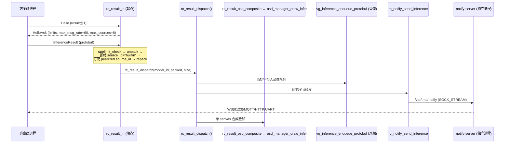

# reCamera Pro 扩展 API 架构说明

> 面向新接手 / 想理解整体设计的工程师。目的：一次读懂扩展 API 的系统分层、数据流、组件关系。
>
> 事实来源：
> - 规格：`RECAMERA_PRO_API_SPEC.md`（§1 传输/身份/握手、§2 帧代理、§3 结果注入、§4 观测、§8 架构与扩展模型、M5/M6）
> - 需求背景：`RECAMERA_PRO_INFERENCE_SDK_DESIGN.md`
> - 方案商入口：`docs/ext/README.md` 及 `docs/ext/*.md`
> - 源码（wsl2-local）：`RV1126B_Linux_IPC_SDK/project/app/recamera_ipc/`
>
> 本文所有组件关系、socket 路径、函数名均从源码核实，带 `file:line`。

---

## 1. 一句话定位与设计哲学

**扩展 API 是 reCamera Pro 固件（rkipc 进程 + 官方推理 + Web 后端 + notify）向第三方进程开放的一组运行时接口：方案商在设备上跑自己的进程，通过 `/run/recamera/` 下的 unix domain socket 拿相机帧、回注检测结果、观测推理内部——不改固件源码、不重编、不刷自编固件。**

四条设计哲学贯穿全系统：

1. **进程边界即契约**。方案商代码与固件代码分属不同进程，交界面是 socket 上的线格式（wire format），不是共享的头文件或链接的库。契约冻结后可跨固件版本演进（§6 扩展五规则）。
2. **不 fork 固件**。设计文档的出发点：方案商拿不到、也不该 fork 固件源码。交付物是一个跑在设备上的可执行程序（C/C++ 二进制或 Python 脚本），而非一份定制固件。
3. **复用官方基础设施**。结果回注不新建渲染/编码/推送通路，而是接进官方推理**已经在走**的三路分发（OSD / 录像 / notify）。前端扩展复用 nginx + JWT 会话。观测面复用帧代理的 fd 传递代码。
4. **官方推理吃自己的狗粮**。内建推理与外部注入走**同一个** `rc_result_dispatch()`（`video.c:656` 内建路径、`rc_result_in.c` 外部路径共同调用）。官方路径先验证了这条分发链，外部注入才可信。

---

## 2. 整体架构图

扩展端点**编译进 rkipc 进程内**（与相机/ISP/VI/VENC/NPU/OSD 同进程）；notify-server 是独立 Python 进程；entry.cgi 是 nginx 拉起的 CGI。方案商进程在设备上独立运行，只通过 socket 与固件通信。

```
┌───────────────────────────── 设备（RV1126B）─────────────────────────────┐
│                                                                          │
│  ┌───────────────────── rkipc 进程（固件主程序）──────────────────────┐  │
│  │  官方媒体流水线（复用，未改动）                                     │  │
│  │    Sensor → ISP → VI(pipe0) → VPSS → VENC → RTSP/录像              │  │
│  │                     │  chn(npu)                                    │  │
│  │                     ├────────→ NPU 推理(rc_model/rc_infer)         │  │
│  │                     │              │                               │  │
│  │                     │      rc_result_dispatch()  ← 内建结果         │  │
│  │                     │        │      │      │      (video.c:656)     │  │
│  │                     │       OSD   录像   notify                     │  │
│  │                     │                                              │  │
│  │  扩展端点（新增，main.c:414-416 启动）                              │  │
│  │  ┌──────────────┐ ┌──────────────┐ ┌──────────────┐               │  │
│  │  │ frame_export │ │ rc_result_in │ │  rc_probe    │  ← 端点层      │  │
│  │  │  (VI chn1)   │ │(→dispatch)   │ │ (infer tap)  │               │  │
│  │  └──────┬───────┘ └──────┬───────┘ └──────┬───────┘               │  │
│  │         │  common/rc_ext_core（核心库，共用）                       │  │
│  └─────────┼────────────────┼────────────────┼──────────────────────┘  │
│            │ frame.sock      │ result-in.sock │ probe.sock              │
│            │ (SEQPACKET+fd)  │ (SEQPACKET)    │ (SEQPACKET+memfd)       │
│         /run/recamera/  [0750 root:recamera-ext, sock 0660]             │
│            │                │                 │                         │
│  ┌─────────┴────────────────┴─────────────────┴──────────────────────┐ │
│  │              方案商进程（自带模型/GUI，root 运行）                    │ │
│  │   librecamera_ext.so.1 (C ABI) / recamera_ext (Python ctypes)      │ │
│  └────────────────────────────────────────────────────────────────────┘ │
│                                                                          │
│  ┌──────────────── notify-server（独立 Python 进程）──────────────────┐  │
│  │  监听 /var/tmp/notify (SOCK_STREAM)                                │  │
│  │  ← rkipc 的 rc_notify 作为客户端连入                                │  │
│  │  → WebSocket(8123) / MQTT / HTTP / UART notifier                  │  │
│  └───────────────────────────────────────────────────────────────────┘  │
│                                                                          │
│  ┌──────── nginx ────────┐   ┌──────── entry.cgi (CGI) ────────┐         │
│  │ /extension/<name>/    │──→│ recamera_web_backend            │         │
│  │ ext_<name>.conf 挂载  │   │ HTTP API（配置/控制，含 M4 ext 域）│        │
│  │ JWT 会话(auth_request)│   │ 内部 RPC: /var/tmp/rkipc（勿直连）│        │
│  └───────────────────────┘   └─────────────────────────────────┘         │
└──────────────────────────────────────────────────────────────────────────┘
```

关键点（源码核实）：

- 三条数据面 socket 全在 **rkipc 进程内**监听，`main.c:414-416` 依次 `rc_result_in_start()` / `frame_export_start()` / `rc_probe_start()`。
- **notify-server 是独立进程**：监听 `/var/tmp/notify`（`notify_server.py:209` `socket_path="/var/tmp/notify"`），rkipc 侧 `rc_notify` 是它的**客户端**（`rc_notify_client.c:36-52` `connect(AF_UNIX, SOCK_STREAM)`）。结果注入并不直连 WS——而是经 dispatch → rc_notify → notify-server → WS/MQTT/HTTP/UART。
- **entry.cgi 是 CGI**（nginx 拉起），承载 HTTP 配置/控制 API 与前端扩展挂载；`/var/tmp/rkipc` 是 rkipc↔entry.cgi 的内部 RPC，对方案商标注 internal（`docs/ext/rkipc-rpc-status.md`）。

---

## 3. 分层模型：一个核心库，N 个薄端点

规格 §8.1 的核心结构：所有难写对的传输/所有权/背压代码只存在一份（`rc_ext_core`），每个端点只写自己的媒体特有逻辑。

```
                        rkipc 进程内
┌───────────────────────────────────────────────────────────────┐
│  端点层（每个 ~200-400 行，只含媒体特有逻辑）                     │
│  ┌──────────────────┐ ┌────────────────┐ ┌──────────────────┐  │
│  │ frame_export.c   │ │ rc_result_in.c │ │ rc_probe.c       │  │
│  │ VI 取帧 + 96B     │ │ proto 校验 +    │ │ infer tap 采样 + │  │
│  │ 头 + plane 填充   │ │ dispatch 调用   │ │ TensorMeta      │  │
│  │ + fd 出借状态机   │ │ + source_id 定钉│ │ + memfd 发送     │  │
│  └──────────────────┘ └────────────────┘ └──────────────────┘  │
├───────────────────────────────────────────────────────────────┤
│  common/rc_ext_core/（核心库，实现一次，三端点共用）             │
│  · ext_socket.{c,h}   SEQPACKET 服务端骨架：bind/accept +        │
│                        poll() 事件循环 + 每连接状态              │
│                        (rc_ext_conn{fd,generation,handshaked,    │
│                         peer,rl})                               │
│  · ext_socket         fd 收发：rc_ext_sendmsg_fd/recvmsg_fd      │
│                        (SCM_RIGHTS，MSG_DONTWAIT/MSG_CMSG_CLOEXEC)│
│  · ext_handshake.{c,h} Hello/HelloAck + 版本区间协商 + Capability│
│  · ext_identity.{c,h}  SO_PEERCRED + apps.d 身份注册表           │
│  · ext_ratelimit.{c,h} 两级 token bucket 配额框架               │
│  · ext_api.pb-c.{c,h}  握手/订阅 proto 的 C 生成代码             │
│  · rc_ext_errno.h      统一错误码（EVERSION/EAUTH/EBUSY/…）      │
└───────────────────────────────────────────────────────────────┘

                        客户端（镜像分层）
┌───────────────────────────────────────────────────────────────┐
│  Python binding（ctypes 薄封装，无独立行为）                     │
│  未来：Node / Rust binding（同一 C ABI 之上）                    │
├───────────────────────────────────────────────────────────────┤
│  librecamera_ext.so.1（C ABI，v1 冻结对象）                      │
│  · rc_ext_frame_* / rc_ext_result_* / rc_ext_probe_*            │
│  · 连接/握手/重连/fd 接收/dma-buf cache sync 全部内置            │
└───────────────────────────────────────────────────────────────┘
```

**规则**：端点层禁止直接碰 socket/fd/配额——全部经 core。核实：`ext_socket.h` 定义 `rc_ext_server`（含 `on_connect`/`on_message`/`on_close` 回调 + `max_conns`）与 `rc_ext_conn`（每连接 `fd`/`generation`/`handshaked`/`peer`/`rl`）；`rc_result_in.c` 的 `on_message` 只做"未握手→`rc_ext_handshake_serve()`、已握手→`rc_ext_ratelimit_check()` + `handle_result()`"，socket/accept/poll 全在 core。

**收益**：① 所有权/背压这类最难写对的代码只有一份，评审级 bug 只修一处；② 新媒体类型（VQE-PCM、file-source 注入）= 新端点薄层 + 新 Capability，**核心零改**；③ core 可 mock 端点单测，不用整机跑。

**开发顺序**：`rc_ext_core` 先行；result-in 是它第一个消费者，frame 是第二个——所有权状态机在 M1 阶段就被真实代码路径覆盖。

> **目录注记**：结果注入端点的实际源码在 `common/rc_notify/`（`rc_result_in.c/h`、`rc_result_dispatch.c/h`、`rc_result_osd.c/h`），与 notify 基础设施同目录，而非规格 §6 表格里写的 `common/rc_result_in/`。帧代理端点在 `src/rv1126b_ipc/video/frame_export.{c,h}`，观测端点在 `common/rc_probe/`，核心库在 `common/rc_ext_core/`。

---

## 4. 四条数据通路

### 4.1 帧代理（相机 → VI chn1 → dma-buf fd → SCM_RIGHTS → 方案商）

```
Sensor→ISP→VI(pipe0)
              │ chn1（内建流水线空闲，gate G1 PASS）
              │ 私有 DMABUF 池（VI_V4L2_MEMORY_TYPE_DMABUF）
              ▼
   RK_MPI_VI_GetChnFrame(FE_PIPE, FE_CHN=1)       frame_export.c
              │
   RK_MPI_MB_Handle2Fd(pMbBlk) → dma-buf fd       frame_export.c:239
              │  每帧建 frame_rec{frame, subscribers_left}
              │  对每订阅者: dup(fd) → sendmsg(96B hdr + 1 fd, SCM_RIGHTS)
              ▼
   frame.sock ── SEQPACKET, ancillary=1 fd ──▶ 方案商
              │                                   rc_ext_frame_next()
              │                                   rc_ext_frame_map() [mmap+SYNC]
   处理完回发 8 字节 seq release 消息 ◀────────── rc_ext_frame_release()
              │
   subscribers_left 归零 → RK_MPI_VI_ReleaseChnFrame（恰好一次）
```

**一句话**：帧代理在同一 VI pipe 开一路空闲的 chn1（私有池，与内建 NPU 通道隔离），把每帧导出为一个 dma-buf fd，用 `SCM_RIGHTS` 零拷贝传给订阅者；无订阅者时 chn disable、零常驻开销（`frame_export.c:138 chn_enable` / `:168 chn_disable`）。

### 4.2 结果注入（方案商 → result-in → rc_result_dispatch → OSD/录像/notify）



**一句话**：方案商发一条 `InferenceResult` 到 `result-in.sock`；端点校验并把 `source_id` 钉成 peercred 身份（外部禁用 `"builtin"`，`rc_result_in.c handle_result`），再交给 `rc_result_dispatch()`——与内建推理**同一个函数**（`rc_result_dispatch.c`），扇出到录像、notify、OSD 三路。

### 4.3 观测（rc_infer tap → probe worker → memfd → 方案商）

```
rc_infer 推理线程（热路径）
   rc_probe_frame_begin()  ← 每帧一次，推进采样抽取
   if (rc_probe_stage_active(stage))       ← 内联：一次 relaxed 原子读 submask
        rc_probe_emit(stage, payload, size, meta)  ← 拷进有界队列，永不阻塞
        │  (无订阅者时 submask==0 → 一次 load + 分支即返回，零拷贝)
        ▼
   [有界队列] ──▶ 独立低优先级 worker 线程
                    │ 小样本(metrics/postproc) → 内联 ProbeData.payload
                    │ 大张量(preproc.out/npu.raw) → memfd + SCM_RIGHTS
                    │ sendmsg(MSG_DONTWAIT)；慢消费者丢样本+计数→退避→断开
                    ▼
              probe.sock ── SEQPACKET(+memfd fd) ──▶ 方案商
```

**一句话**：`rc_infer` 流水线各 stage（preproc.out / npu.raw / postproc.out / metrics）插 tap，热路径只做一次原子读判断有无订阅者；采样经有界队列交独立低优先级 worker 序列化发送，大张量走 memfd + `SCM_RIGHTS`——任何情况下不阻塞推理主线程（`rc_probe.h`，规格 §4.1）。

### 4.4 控制（方案商 → nginx / entry.cgi → ext API）

```
方案商前端(浏览器)                方案商后端进程
      │                                │
      │ HTTPS /extension/<name>/       │ ext_<name>.conf 挂载
      ▼                                ▼
   ┌─────────────── nginx ────────────────┐
   │ auth_request → 复用官方 dashboard JWT │
   │ /api/... 反代 → entry.cgi (CGI)       │
   └───────────────────┬───────────────────┘
                       ▼
              entry.cgi / recamera_web_backend
              · /api/v1/... 配置/控制（model/video/osd/system）
              · M4: /api/v1/ext/capabilities、/ext/subscriptions
              · 内部 RPC /var/tmp/rkipc（internal，勿直连）
```

**一句话**：控制/配置走 HTTP，不走数据面 socket——方案商把网页 + 后端用 `ext_<name>.conf` 挂到 nginx 的 `/extension/<name>/`，复用官方 JWT 会话（`auth_request`）；配置类请求经 entry.cgi HTTP API，M4 起提供版本化 `/api/v1/ext/*` 域（`docs/ext/frontend-extension.md`、`docs/ext/control-api.md`、规格 §5.1）。

---

## 5. 关键机制

### 5.1 握手与版本协商（`ext_handshake`）

连接后客户端先发 `Hello{version_min, version_max, client_name, auth}`，服务端在 `[version_min, version_max]` 与自身支持集合的**交集**内取最大值回 `HelloAck{api_version, auth_mode, capabilities[], error}`；交集为空 → `EVERSION` + 关闭（**不是 `min(client, server)`**）。每端点在 `on_message` 未握手分支构造自己的 `Capability`（如 result 端点：`name="result", version=1, limits{max_msg_rate=60, max_sources=8}`，`rc_result_in.c on_message`）。客户端必须按握手回填的 `limits` 自适应，不得硬编码。

### 5.2 peercred 身份（`ext_identity`）

服务端对每个连接 `getsockopt(SO_PEERCRED)` 取 pid/uid/gid（`ext_identity.c:78`）。用 uid 查 `/run/recamera/apps.d/<name>.conf`（内容 `uid=<n>`，root 只写）：命中 → 用 `<name>` 作 `source_id`；未命中 → 强制改写为 `"uid:<n>"`（`ext_identity.c:85-86`）。`"builtin"` 为保留字，外部连接一律拒绝（`rc_ext_source_is_reserved`，`on_connect` 返回 `EAUTH`）。

> 上机实证（V1.0.10）：扩展进程经 `appmgr serve` 以 **root** 启动（媒体设备节点均 root 属主）。v1 的 peercred 绑定实际区分"哪个 root 扩展"而非非特权 uid，扩展间无强隔离——沙箱是后续平台责任（规格 §1.1）。

### 5.3 单次持帧所有权模型（`subscribers_left`）

MPI 层每帧只有一次 Get/Release（MPI 无公开增引用接口）。服务端 `GetChnFrame` 后建 `frame_rec{frame, subscribers_left}`，出借给 k 个订阅者即 `subscribers_left = k`；每个订阅者 release（回发 8 字节 seq）→ `subscribers_left--`；归零 → 恰好一次 `RK_MPI_VI_ReleaseChnFrame`（`frame_export.c:122,211,223`）。断线清理与 release 在同一事件循环内串行化，用每连接 `generation` 防跨代重放。gate G2 已实测：fd 存活期间硬件不复用该 buffer，无需防御性 memcpy。

### 5.4 背压（EAGAIN 丢帧 + held ≤ N-3）

三条铁律（规格 §2.4）：

1. **发送永不阻塞**：`rc_ext_sendmsg_fd` 内部 `MSG_DONTWAIT|MSG_NOSIGNAL`；`EAGAIN` → 本订阅者跳过该帧（置 `flags.bit0` + seq gap），无每连接发送队列。
2. **按物理 buffer 全局预留**：`held` = 借出 frame_rec 数 + 在途采集帧（≤1）；**采集前判定 `held ≤ N-3`（`FE_HELD_CAP = FE_POOL_DEPTH-3`，`frame_export.c:54`）才 GetChnFrame**——任何时刻至少 2 个 buffer 空闲给 VI。
3. **两级配额**：每连接 `max_outstanding`（默认 2）+ 全局按第 2 条。

发送四步原子序列（`frame_export.c:281` 附近）：①配额检查 ②`dup(fd)` ③登记 outstanding + `subscribers_left++` ④`sendmsg`；任一步失败立即回滚（close dup fd / 撤销登记 / 计数减）。持续 5 秒 outstanding 满且零 release → 判死，断开（`EBACKPRESSURE`）。

### 5.5 零拷贝（dma-buf fd + cache 同步）

帧数据不经 socket 复制——只传一个 dma-buf fd（`RK_MPI_MB_Handle2Fd`，`frame_export.c:239`），客户端 `mmap` 后直接读硬件写入的内存。plane 的 `offset/stride/vstride` 由服务端按 MPI 实际分配填进 96 字节头，客户端**禁止**自行按 w/h 推导。CPU 访问前后必须 `DMA_BUF_IOCTL_SYNC(START|READ)` / `(END|READ)`，SDK 的 `rc_ext_frame_map/release` 内部完成。

```c
// 96 字节帧头（frame_export.h，FROZEN，_Static_assert(sizeof==96)）
struct frame_hdr {
    uint32_t magic;   // 0x52434652 "RCFR"
    uint16_t ver;     // =1
    uint16_t flags;   // bit0: 自上条消息以来丢过帧
    uint64_t seq;     // 单调递增，含被丢弃帧（gap 可检测）
    uint64_t pts_us;  // VI u64PTS = CLOCK_MONOTONIC 微秒（gate G3）
    uint32_t width, height, fourcc, buf_size;
    uint8_t  chn_id, n_planes; uint16_t reserved0;
    struct frame_plane plane[3];   // {offset,stride,vstride}×3；NV12: [0]=Y,[1]=UV
    uint8_t  reserved[16];         // 结构演进保留位
};
```

### 5.6 OSD 单 canvas 合成 + RGN layer

`rc_result_osd_composite()`（`rc_result_osd.c/h`）缓存每个 `source_id` 的最新 DETECTION 集合，把所有 source（含 builtin）的并集画进**同一个** overlay region、按 `source_id` 哈希调色，再推给 `osd_manager_draw_infer()`。因此 `max_sources` 不受 RGN 每通道 attach 上限 8 的硬约束（capability 报软上限 8）。退路是每 source 独立 RGN（`max_sources=6`）。gate G4 已 PASS。

---

## 6. 扩展五规则 + 兼容性工程

### 6.1 扩展五规则（对方案商的承诺，规格 §8.2）

| # | 规则 | 含义 |
|---|---|---|
| 1 | **加法优先** | 新能力 = 新 socket 路径 + 新 Capability + 新 proto 消息；现有端点线格式/路径/语义不动 |
| 2 | **数量演进走 limits** | 并发/速率/池深变化只改 `Capability.limits` 数值，客户端按握手返回值自适应，不得硬编码 |
| 3 | **结构演进走保留位** | `frame_hdr` 的 `ver` + `reserved[16]` 承载新字段；重排/删字段才升 `ver`，旧 `ver` 至少再支持两个固件版本 |
| 4 | **任务类型演进走 oneof 追加** | `InferenceResult` 新任务 = 新 oneof 分支（tag 15+），旧读者跳过未知分支 |
| 5 | **只增不减** | `/run/recamera/` 存在期间，v1 baseline `frame@1`/`result@1`/`probe@1` 与其线格式永不移除 |

配套 schema 纪律：proto tag 永不复用；删字段必 `reserved`；中转组件（notify-server）转发外来 payload **透传原始字节，禁止 decode→re-encode**（`rc_result_dispatch.c` 注释：录像与 notify 拿"ORIGINAL per-source bytes"）。

### 6.2 兼容性工程（CI 化，规格 §8.3）

- **golden corpus**：每个发布版的 proto 消息样本（各类型 × 边界值）入库；CI 双向解析（当前代码解历史 corpus + 历史生成器解当前消息）。
- **跨版本矩阵**：v1 SDK ↔ 当前服务端、当前 SDK ↔ v1 服务端，各跑握手 + 一次完整业务往返，进固件 CI。
- **ABI 检查**：`librecamera_ext.so.1` 用 libabigail（`abidiff`）对上一发布版做符号级对比，破坏性变更 = CI 红灯；soname semver。
- M1/M2 期间先手工执行留档，M4 收口时作为 CI 交付物。

---

## 7. 能力全景（M0–M6 + DSI + 沙箱）

| 能力 | 里程碑 | 端点 / 对接方式 | 状态 |
|---|---|---|---|
| 结果注入（OSD+录像+推送） | M1 | `result-in.sock` / `rc_ext_result_*` / `ResultSink` | 现成可用 |
| 帧代理（零拷贝取帧 + C ABI） | M2 | `frame.sock` / `rc_ext_frame_*` / `FrameSource` | 现成可用（G1–G4 真机 PASS） |
| 音频 PCM | M0 | `arecord -D ai_asr`（ALSA dsnoop） | 现成可用 |
| GPIO 结果触发 | M0 | notify WS + gmgr API（组合现有零件） | 现成可用 |
| 前端扩展挂载 | M0 | `ext_<name>.conf` + `/extension/<name>/`（JWT 复用） | 现成可用 |
| 结果推送（notify legacy） | M0 | `/var/tmp/notify`（仅分发、不叠加、0666 无鉴权、受限） | 现成可用 |
| rkipc RPC 现状文档化 | M0 | entry.cgi HTTP API（`/var/tmp/rkipc` internal） | 现成可用 |
| 观测面（preproc/npu.raw/postproc/metrics） | M3 | `probe.sock` / `rc_ext_probe_*` | 端点在库，前端呈现规划中 |
| 控制面（版本化 + capabilities + app token） | M4 | `/api/v1/ext/*`（entry.cgi） | 规划中 |
| DSI 屏自定义显示（整屏出租 + 帧代理自绘） | M5 | 复用 M2 帧代理 + LVGL/DRM（`/dev/dri/card0`） | 规划中（依赖 M2） |
| 生态框架接入（GStreamer/FFmpeg/OpenCV/v4l2loopback） | M6 | 基于 M2 dma-buf + M1 result-in | 拿帧+软件处理实测通；硬件编码回推待补 |
| 沙箱与打包签名分发 | 后续 | app token + appmgr 集成 | 规划中 |

---

## 8. 与官方固件的边界

**核心区分：哪些是复用官方现成的、哪些是本扩展层新增的。**

| 类别 | 组件 | 归属 |
|---|---|---|
| **复用官方现成** | 相机 / ISP / VI / VPSS / VENC / RTSP | rkipc 官方媒体流水线，未改动 |
| | NPU 推理（rc_model / rc_infer） | 官方，观测面只旁挂 tap |
| | OSD 渲染（`osd_manager_draw_infer`、RGN） | 官方渲染，结果注入接进它 |
| | notify-server（WS/MQTT/HTTP/UART） | 官方独立 Python 进程，结果注入经 rc_notify 复用 |
| | nginx + entry.cgi + JWT 会话 | 官方 Web 基建，前端扩展与控制面复用 |
| | appmgr（扩展进程拉起） | 官方进程管理器 |
| **本扩展层新增** | `common/rc_ext_core/`（传输核心库） | 新增（先行） |
| | `frame_export.{c,h}`（帧代理端点 + VI chn1） | 新增 |
| | `rc_notify/rc_result_in.c` + `rc_result_dispatch.c` + `rc_result_osd.c` | 新增（dispatch 抽出、内建路径共用） |
| | `common/rc_probe/`（观测端点） | 新增 |
| | `ext_api.proto` + `inference.proto` 的 `source_id`/`pts_us` | 新增（兼容） |
| | `librecamera_ext.so.1`（C ABI）+ Python 封装 | 新增（客户端） |

**闭源/可改边界**：扩展 API 对**方案商闭源**——他们只拿到 socket 契约 + `librecamera_ext.so` + 文档，拿不到固件源码。对 **Seeed 自己源码可改**——端点层、核心库、dispatch 均在固件树内，Seeed 可迭代实现，只要不破坏已冻结的线格式与 C ABI（由 §6 兼容性工程守住）。

`video.c:656` 内建推理与 `rc_result_in.c` 外部注入调用**同一** `rc_result_dispatch()`，是这条边界的具体体现：官方先吃自己的狗粮，外部注入沿用已验证的分发链。
